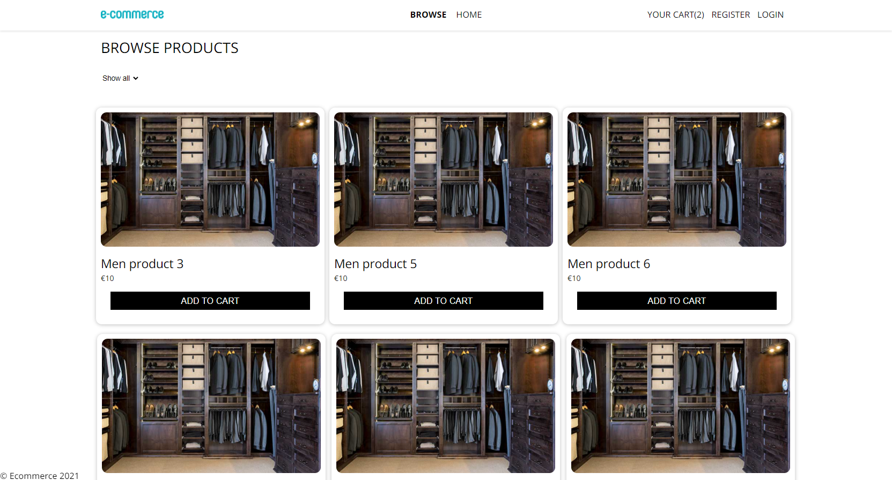
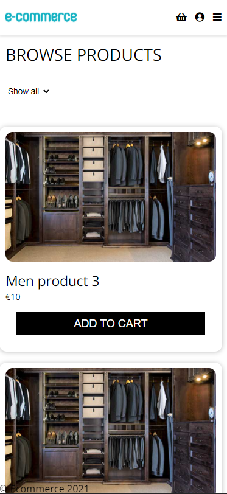

# Ecommerce App

## Pictures

*The Welcome Page*

*Product Page*

*Mobile Compatibility*

## Features
This repository contains a react app which has the following features:
* User Sign up and Login
* Email recovery
* Browse the shop
* Add items to cart
* Order items
* Login as admin and manage the shop
* Responsive Website

## Install and run
To test it out for yourself clone the repository with:

`git clone https://github.com/rinorbardiqi/ecommerce-app.git`

Run `npm install`

Then `npm start` and go to localhost:3000

## Live preview
Go to this link to try it out: https://ecommerce-app-349b0.web.app/
